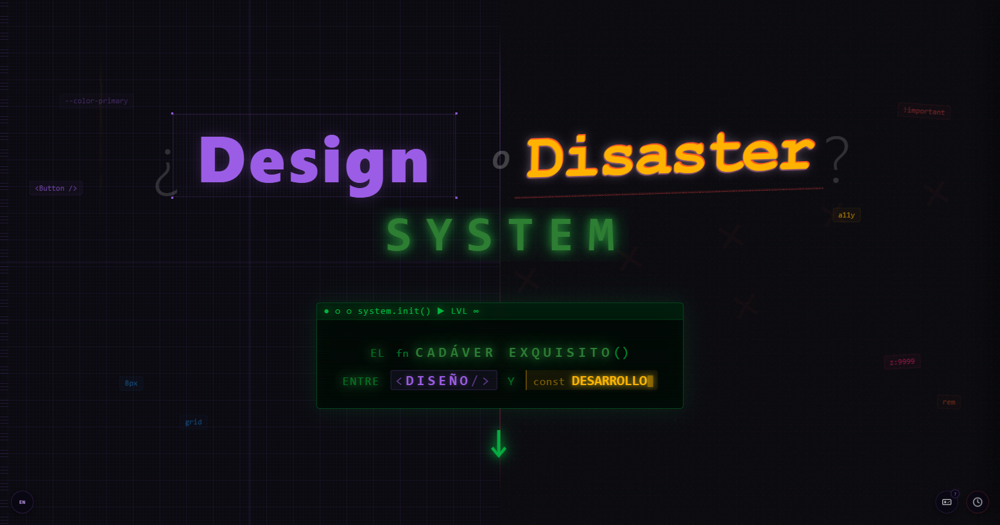

# Design System or Disaster System? · ¿Design System o Disaster System? 🧟‍♂️

> *The exquisite corpse between design and development.*  
> *El cadáver exquisito entre diseño y desarrollo.*

🔗 **Live demo / Demo en vivo:** [](https://muirogles.github.io/disaster-system/)

[](https://github.com/muirogles/disaster-system)
[](https://creativecommons.org/licenses/by-nc-sa/4.0/)

---

## English

### What is this?

An interactive landing page built to support a live tech talk about Design Systems — using the **Exquisite Corpse** game mechanic to make the abstract tangible, the technical playful, and the collaborative unforgettable.

The talk uses an old surrealist parlour game to show, live on stage, what happens when designers, developers, and mixed-profile teams build *without a shared system*:

1. A group of volunteers from the audience each draw one section of a body (head / trunk / legs) in **30 seconds**, without seeing what the others drew.
2. They fold the paper and pass it on.
3. The result is revealed: a glorious, chaotic **Disaster System** creature.
4. The landing then **transforms** that creature into a healthy, coordinated human — a Design System done right.

Each body part maps to a real Design System concept, explored live with code snippets and tool recommendations.

### Body Parts → Design System Concepts

| Body Part | Concept |
|---|---|
| 🧠 Brain | Design Tokens & naming strategy |
| 👁️ Eyes | Visual accessibility (contrast, focus, retina) |
| 👂 Ears | Semantic HTML & screen reader support |
| 👄 Mouth | Internationalisation (i18n) & content strategy |
| 🦴 Trunk | CSS architecture & layout |
| ❤️ Heart | Components, instances & versioning |
| 💪 Arms | Z-index hierarchy & skeleton screens |
| 🤚 Hands | Touch targets, pointer events & scroll lock |
| 🦿 Legs | Responsive design & fluid units |
| 🦶 Feet | Scalability, methodology & audits |
| 🦎 Tail | Technical debt & legacy dependencies |

### Features

- **30-second countdown timer** with a Web Audio API heartbeat synthesizer — escalating urgency, full explosion alarm at zero
- **Interactive body parts** — click any part to open a modal panel with code snippets, error examples, and tool recommendations
- **Reanimate button** — CSS transitions that transform the Frankenstein/Tin Man/Lizard creature into a healthy human
- **ES / EN language toggle** — full i18n support, persisted in `localStorage`
- **LinkedIn share CTA** — direct share button pointing to the live demo
- **No build step** — pure HTML, CSS, and vanilla JS

### Tech Stack

- **Vite** — fast development server and optimized build bundling
- **Web Audio API** — procedural heartbeat, alarm, shock, and success sounds
- **CSS custom properties** — design tokens for the entire visual system
- **CSS art** — all body parts drawn in pure CSS, no images
- **Vanilla i18n** — lightweight ES/EN switching with JSON translation files
- **GitHub Actions** — automated CI/CD for GitHub Pages

### Development & Deployment

This project uses **Vite** for a modern development experience.

#### Local Development
1. Install dependencies: `npm install`
2. Start the dev server: `npm run dev`
3. Open `http://localhost:5173/disaster-system/`

#### Deployment
Deployment is **automatic** via **GitHub Actions**. Simply push your changes to the `main` or `develop` branch. Ensure your repository settings under **Settings > Pages** are set to **"GitHub Actions"** as the source.

**Timer:** Press **Space** or click the clock FAB to start · press again to stop.

---

## Español

### ¿Qué es esto?

Una landing interactiva creada para apoyar en directo una charla técnica sobre Design Systems — usando el juego del **Cadáver Exquisito** para hacer lo abstracto tangible, lo técnico lúdico y lo colaborativo inolvidable.

La charla utiliza el juego surrealista del Cadáver Exquisito para demostrar en vivo qué ocurre cuando diseñadores, desarrolladores y perfiles mixtos construyen *sin un sistema compartido*:

1. Un grupo de voluntarios del público dibuja cada uno una sección del cuerpo (cabeza / tronco / piernas) en **30 segundos**, sin ver lo que han dibujado los demás.
2. Doblan el papel y lo pasan.
3. Se revela el resultado: una criatura gloriosa y caótica — el **Disaster System**.
4. La landing **transforma** esa criatura en un ser humano sano y coordinado: un Design System bien hecho.

Cada parte del cuerpo corresponde a un concepto real de Design System, explorado en directo con snippets de código y recomendaciones de herramientas.

### Partes del cuerpo → Conceptos del Design System

| Parte | Concepto |
|---|---|
| 🧠 Cerebro | Design Tokens y estrategia de naming |
| 👁️ Ojos | Accesibilidad visual (contraste, foco, retina) |
| 👂 Orejas | HTML semántico y lectores de pantalla |
| 👄 Boca | Internacionalización (i18n) y contenidos |
| 🦴 Tronco | Arquitectura CSS y layout |
| ❤️ Corazón | Componentes, instancias y versiones |
| 💪 Brazos | Jerarquía z-index y skeleton screens |
| 🤚 Manos | Touch targets, pointer events y scroll lock |
| 🦿 Piernas | Diseño responsive y unidades fluidas |
| 🦶 Pies | Escalabilidad, metodología y auditorías |
| 🦎 Cola | Deuda técnica y dependencias legacy |

### Funcionalidades

- **Cronómetro de 30 segundos** con sintetizador procedural (Web Audio API) — latido que escala en urgencia y explosión de alarma al llegar a cero
- **Partes del cuerpo interactivas** — click en cualquier parte para abrir un panel modal con snippets, errores y herramientas recomendadas
- **Botón Reanimar** — transiciones CSS que transforman la criatura en un ser humano coordinado
- **Selector de idioma ES / EN** — i18n completo, con renderizado de HTML en traducciones
- **CTA de compartir en LinkedIn** — botón de compartir directo a la demo en vivo
- **Automatización con Vite** — bundling de CSS y JS para máximo rendimiento

### Desarrollo y Despliegue

Este proyecto utiliza **Vite** para una experiencia de desarrollo moderna.

#### Desarrollo Local
1. Instala dependencias: `npm install`
2. Arranca el servidor: `npm run dev`
3. Abre `http://localhost:5173/disaster-system/`

#### Despliegue
El despliegue es **automático** mediante **GitHub Actions**. Solo tienes que hacer `push` de tus cambios. Asegúrate de que en **Settings > Pages** el origen sea **"GitHub Actions"**.

**Cronómetro:** Pulsa **Espacio** o el FAB del reloj para iniciar · pulsa de nuevo para detener.

---

## Project Structure / Estructura

```
disaster-system/
├── index.html              # Main page / Página principal
├── package.json            # Vite & dependencies / Configuración y dependencias
├── vite.config.js          # Vite build config / Configuración de build
├── css/                    # Styles / Estilos
├── js/                     # Logic / Lógica
├── public/                 # Static assets (i18n & img) / Archivos estáticos
└── .github/workflows/      # CI/CD deployment logic / Automatización de despliegue
```


---

## License / Licencia

[CC BY-NC-SA 4.0](https://creativecommons.org/licenses/by-nc-sa/4.0/) — Free to share and adapt for non-commercial purposes with attribution · Libre para compartir y adaptar con fines no comerciales citando a la autora.

---

## Credits / Créditos

**Speaker & creator / Ponente y creadora:** [María Rogles López](https://linkedin.com/in/mariarogles)  
**Event / Evento:** [Women Techmakers Madrid](https://linkedin.com/in/wtmmadrid) × Celonis — International Women's Day 2026

---

`#DisasterSystem` `#DesignSystem` `#WTMMadrid` `#BreakThePattern` `#BuildWithIA`
